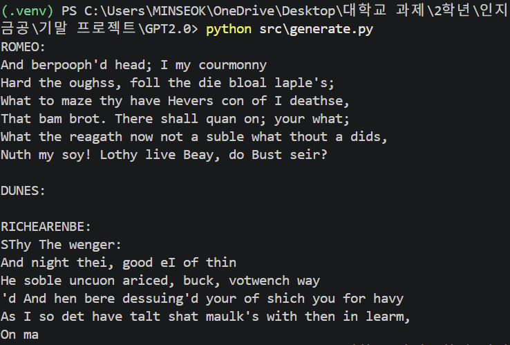

1. 프로젝트 소개

이 프로젝트는 GPT 2.0 모델을 직접 구현해보는 프로젝트이다. 이 프로젝트에서는 Tiny Shakespeare 데이터를 사용하여 모델을 학습시키고, 학습된 모델이 새로운 텍스트를 생성하도록 구현했다.

2. 파일 설명

dataset.py는 Tiny Shakespeare 데이터를 불러오고, 글자를 숫자로 바꾸는 역할을 한다. 또한 모델 학습에 사용할 입력값 x와 정답값 y를 만든다.

model.py는 TinyGPT 모델의 구조를 담고 있다. attention head, multi-head attention, feedforward layer, transformer block, TinyGPT 모델이 이 파일에 구현되어 있다.

train.py는 모델을 학습시키는 파일이다. 텍스트 데이터를 이용해 다음 글자를 예측하도록 모델을 학습하고, 학습이 끝나면 모델을 저장한다.

generate.py는 저장된 모델을 불러와서 새로운 텍스트를 생성하는 파일이다.

3. 실행 방법

1) 가상환경 생성
   py -m venv .venv
2) 가상환경 실행
   .venv\Scripts\activate
3) 필요한 라이브러리 설치
   pip install -r requirements.txt
4) 모델 학습
   python src\train.py
5) 텍스트 생성
   python src\generate.py

4. 실행 결과

5. 모델 구조

이 프로젝트에서 구현한 GPT2.0은 글자 단위로 다음 글자를 예측하는 모델이다. 먼저 텍스트를 숫자로 바꾼 뒤, token embedding과 positional embedding을 통해 글자 정보와 위치 정보를 함께 사용한다.

그다음 masked self-attention을 이용하여 현재 위치보다 뒤에 있는 글자는 보지 못하게 하고, 앞에 나온 글자들만 참고해서 다음 글자를 예측하도록 했다. 이후 multi-head attention, feedforward layer, layer normalization, transformer block을 쌓아서 GPT2.0 모델을 구성했다.
